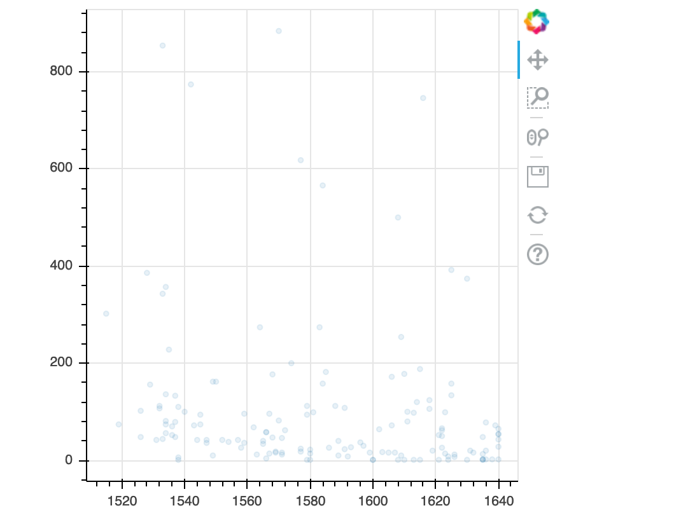
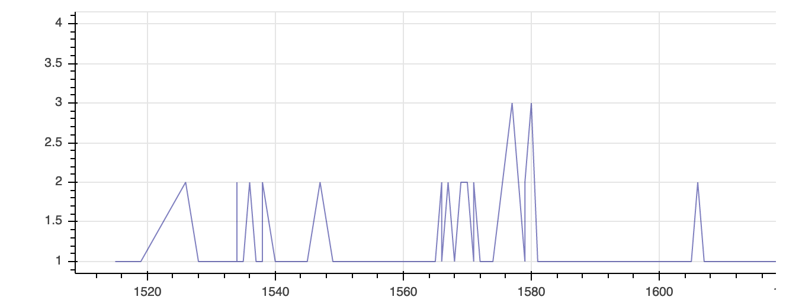
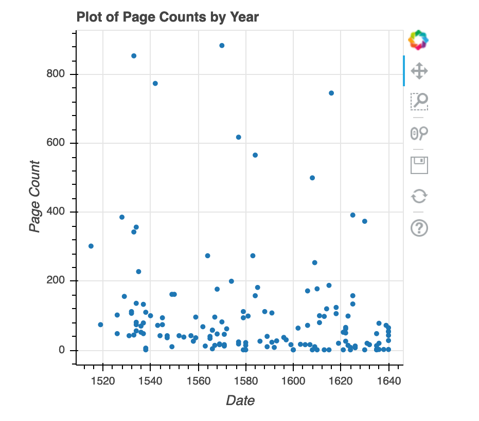

::::::::::::::::::::::::::::::::::::::: objectives

- Create a ggplot object
- Set universal plot settings
- Modify an existing ggplot object
- Change the aesthetics of a plot such as colour
- Edit the axis labels
- Build complex plots using a step-by-step approach
- Create scatter plots, box plots, and time series plots
- Use the `facet_wrap` and `facet_grid` commands to create a collection of plots splitting the data by a factor variable
- Create customized plot styles to meet their needs

::::::::::::::::::::::::::::::::::::::::::::::::::

:::::::::::::::::::::::::::::::::::::::: questions

- Can I use Python to create plots?
- How can I customize plots generated in Python?

::::::::::::::::::::::::::::::::::::::::::::::::::

##### Disclaimer

Python has powerful built-in plotting capabilities such as `matplotlib`, but
for this exercise, we will be using the [`bokeh`](https://docs.bokeh.org/en/latest/)
package, which facilitates the creation of highly-informative plots of
structured data.

```python
import pandas as pd

authors_complete = pd.read_csv( 'eebo.csv', index_col=0)
authors_complete.index.name = 'X'
authors_complete
```

```
        EEBO    VID  ... Page Count             Place
```

X                        ...  
A00002  99850634  15849  ...        134            London
A00005  99842408   7058  ...        302            London
A00007  99844302   9101  ...        386            London
A00008  99848896  14017  ...         14  The Netherlands?
A00011  99837000   1304  ...         54         Amsterdam
A00012  99853871  19269  ...         99            London
A00014  33143147  28259  ...          1            London
A00015  99837006   1310  ...         16            London
A00018  99850740  15965  ...         26          Germany?

149 rows x 10 columns

```python
from bokeh.plotting import figure, output_file, show
from bokeh.io import output_notebook
```

## Plotting with bokeh

We will make the same plot using the `bokeh` package.

`bokeh` is a plotting package that makes it simple to create complex plots
from data in a dataframe. It uses default settings, which help creating
publication quality plots with a minimal amount of settings and tweaking.

bokeh graphics are built step by step by adding new elements.

To build a bokeh plot we need to:

- bind the plot to a specific data frame using the `data` argument

- define figure (`figure`), by selecting the variables to be plotted and the variables to define the presentation
  such as plotting size, title etc.,

We also set some notebook settings with a "output\_notebook()" statement to get interactive
and exportable plots

```python
output_notebook()

p = figure(plot_width=400, plot_height=400)

```

{alt='png'}

We can add simple points to create a scatter plot using circle.

```python
list_dates = authors_complete['Date']
list_numbers = authors_complete['Page Count']
p.circle(list_dates, list_numbers)
show(p)
```

{alt='png'}

## Building your plots

We can add extra arguments into circle's argument.

For comparison, we create a new figure and then add the
alpha argument to circle to change the opacity of the points.

```python
p1 = figure(plot_width=400, plot_height=400)

p1.circle(list_dates, list_numbers, alpha=0.1)

show(p1)
```

{alt='png'}

We can also add colors for all the points.

```python
p2 = figure(plot_width=400, plot_height=400)

p2.circle(list_dates, list_numbers, color="blue", alpha=0.1)

show(p2)
```

{alt='png'}

## Plotting time series data

Let's calculate number of counts per year across the dataset. To do that we need
to group data first and count records within each group.

```python
yearly = authors_df[['Date','Place','Page Count']].groupby(['Date', 'Place']).count().reset_index()
```

```python
p3 = figure(plot_width=800, plot_height=250)

p3.line(yearly['Date'], yearly['Page Count'], color='navy', alpha=0.5)

show(p3)
```

```
year 	place 	count
```

0 	1515 	London 	1
1 	1519 	Londini 	1
2 	1526 	London 	2
3 	1528 	London 	1
4 	1529 	Malborow i.e. Antwerp 	1
5 	1531 	London 	1

[121 rows x 3 columns]

Timelapse data can be visualised as a line plot with years on x axis and counts
on y axis.

```
p3 = figure(plot_width=800, plot_height=250)
p3.line(yearly['Date'], yearly['Page Count'], color='navy', alpha=0.5)
show(p3)
```

{alt='png'}

## Customization

Now, let's add a title to this figure:

```python
from bokeh.models import ColumnDataSource, Range1d, LabelSet, Label

p4 = figure(title="Plot of Page Counts by Year", plot_width=400, plot_height=400)

p4.circle(list_dates, list_numbers)

p4.xaxis[0].axis_label = 'Date'
p4.yaxis[0].axis_label = 'Page Count'

show(p4)
```

{alt='png'}

or we canadd labels to the axes and change the font size for the labels

```python
p5 = figure(title="Plot of Page Counts by Year", plot_width=400, plot_height=400)

p5.circle(list_dates, list_numbers)

p5.xaxis[0].axis_label = 'Date'
p5.yaxis[0].axis_label = 'Page Count'
p5.xaxis[0].axis_label_text_font_size = "24pt"

show(p5)
```

{alt='png'}

With all of this information in hand, please take another five minutes to either
improve one of the plots generated in this exercise or create a beautiful graph
of your own.

Here are some ideas:

- Can you find a way to change its labels?
- Use a different color palette.

After creating your plot, you can save it to a file as a png file:

```python
from bokeh.io import export_png

export_png(p4, filename="plot.png")
```


