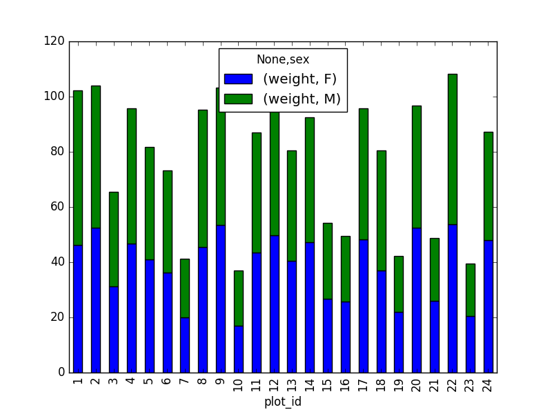
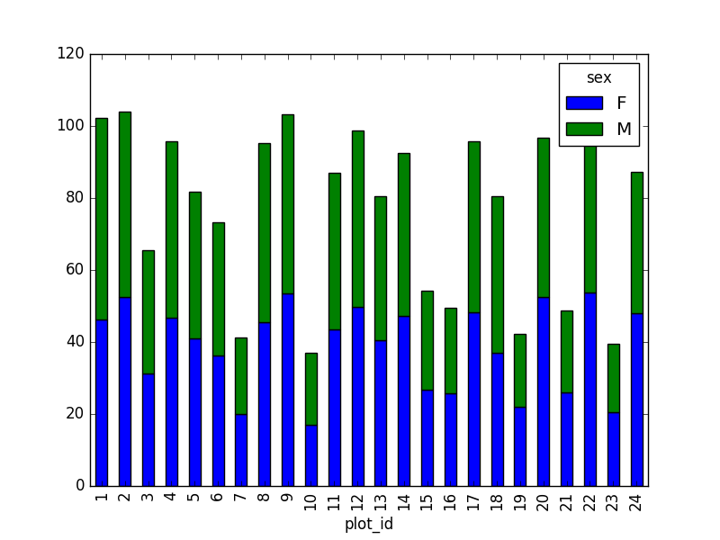
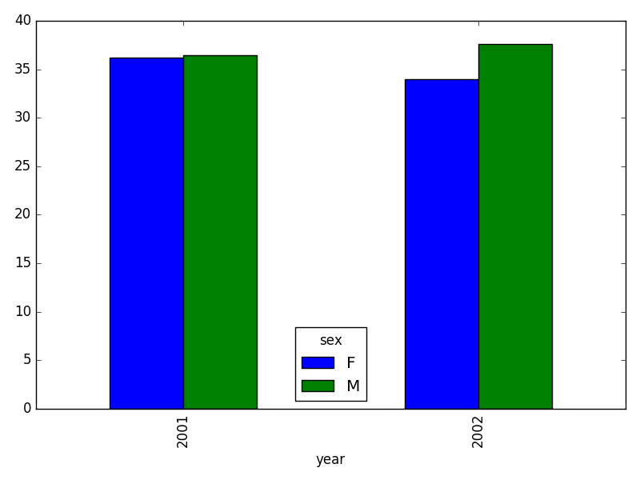
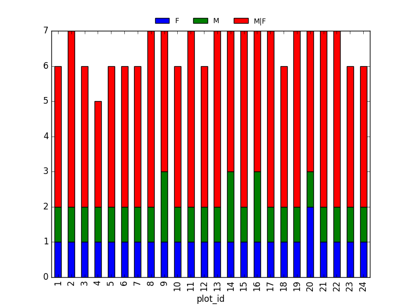
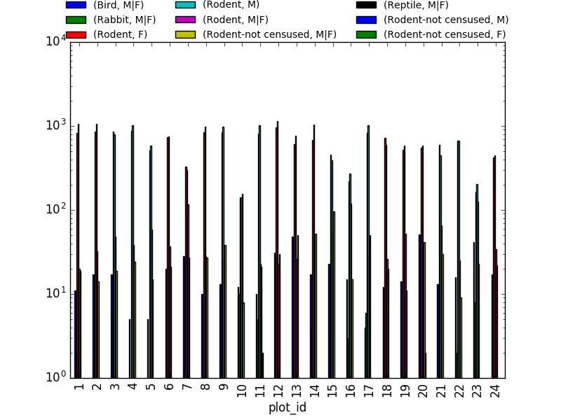
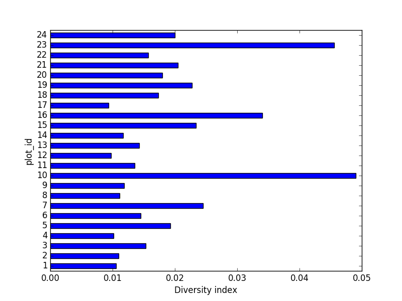

# Challenge solutions

## 00-short-introduction-to-Python

* What happens when you type `a_tuple[2] = 5` vs `a_list[1] = 5`?

	As a tuple is immutable, it does not support item assignment. Elements in a list can be altered individually.

* Type `type(a_tuple)` into python - what is the object type?

	`tuple`

* Can you do reassignment in a dictionary? Give it a try.

Make sure it is also clear that access to 'the second value' is actually just about the key name. Add for example `rev[10] = "ten"` to clarify it is not about the position.

## 01-starting-with-data

* `surveys_df.columns` 

	column names (optional: show `surveys_df.columns[4] = "plotid"` The index is not mutable; recap of previous lesson. Adapting the name is done by `rename` function `surveys_df.rename(columns={"plot_id": "plotid"})`)

* `surveys_df.head()`. Also, what does `surveys_df.head(15)` do?

	Show first `N` lines
	
* `surveys_df.tail()`
	
	Show last `N` lines
	
* `surveys_df.shape`. Take note of the output of the shape method. What format does it return the shape of the DataFrame in?

`type(surveys_df.shape)` -> `Tuple`

* Create a list of unique plot ID's found in the surveys data. Call it `plot_names`. How many unique plots are there in the data? How many unique species are in the data?

`plot_names = pd.unique(surveys_df["plot_id"])` Number of unique plot ID's: `plot_names.size` or `len(plot_names)`; Number of unique species in the data: `len(pd.unique(surveys_df["species"]))`

* How many recorded individuals are female `F` and how many male `M`?

`sorted.count()`

* What happens when you group by two columns using the following syntax and then grab mean values?

The mean value for each combination of plot and sex is calculated. Remark that the mean does not make sense for each variable, so you can specify this column wise: e.g. I want to know the last survey year, median foot-length and mean weight for each plot/sex combination: `surveys_df.groupby(['plot_id','sex']).agg({"year": 'min', "hindfoot_length": 'median', "weight": 'mean'})`

*  Summarize weight values for each plot in your data

`surveys_df.groupby(['plot_id'])['weight'].describe()`

* What's another way to create a list of species and associated count of the records in the data? 

Instead of getting the column of the groupby and counting it, you can also count on the groupby (all columns) and make a selection of the resulting data frame: `surveys_df.groupby('species_id').count()["record_id"]` 

* Create a plot of average weight across all species per plot.

`surveys_df.groupby('plot_id').mean()["weight"].plot(kind='bar')`

 

* Create a plot of total males versus total females for the entire datase

`surveys_df.groupby('sex').count()["record_id"].plot(kind='bar')`


## 02-index-slice-subset

* What value does the code below return? a[0]

`1`  Python starts with element 0 (for Matlab users: this is different)

* How about this: a[5]

`IndexError`

* Or this? a[len(a)]

`IndexError`

* In the example above, calling a[5] returns an error. Why is that?

5th element is a not existing element of the list (going from 0 till 4)

* What happens when you type:

`surveys_df[0:3]`
`surveys_df[:5]` slicing from first element makes 0 redundant
`surveys_df[-1:]` you can count back
Additional: You can also select every Nth row: `surveys_df[1:10:2]`. So, how to interpret `surveys_df[::-1]`?

* difference of `dat.iloc[0:4, 1:4]` versus `dat.loc[0:4, 1:4]`

Check the position, or the name. Cfr. the second is like it would be in a dictionary, asling for the key-names. Column names 1:4 do not exist, resulting in an error. Check also difference between `dat.loc[0:4]` and `dat.iloc[0:4]`

* Select a subset of rows in the `surveys_df` DataFrame that contain data from the year 1999 and that contain weight values less than or equal to 8. How many columns did you end up with? What did your neighbor get?

`surveys_df[(surveys_df["year"] == 1999) & (surveys_df["weight"] <= 8)]`; when only interested in how many, the sum of True values could be used as well: `sum((surveys_df["year"] == 1999) & (surveys_df["weight"] <= 8))` 

* You can use the `isin` command in python to query a DataFrame based upon a list of values as follows: `surveys_df[surveys_df['species_id'].isin([listGoesHere])]`. Use the `isin` function to find all plots that contain particular species in the surveys DataFrame. How many records contain these values?

For example, using `PB` and `PL`:  `surveys_df[surveys_df['species_id'].isin(['PB', 'PL'])]['plot_id'].unique()` provides a list of the plots with these species involved. With `surveys_df[surveys_df['species_id'].isin(['PB', 'PL'])].shape` the number of records can be derived.

* Create a query that finds all rows with a weight value > or equal to 0.

`surveys_df[surveys_df["weight"] >= 0]` Introduce already that all these slice operations are actually based on a *Boolean indexing* operation (next section in the lesson). The filter provides for each record if it satisfies (True) or not (False). The slicing itself interprets the True/False of each record.

* The `~` symbol in Python can be used to return the OPPOSITE of the selection that you specify in python. It is equivalent to is not in. Write a query that selects all rows that are NOT equal to 'M' or 'F' in the surveys data.

`surveys_df[~surveys_df["sex"].isin(['M', 'F'])]`

* Create a new DataFrame that only contains observations with sex values that are not female or male. Assign each sex value in the new DataFrame to a new value of 'x'.  Determine the number of null values in the subset.

New dataframe with the not male/female values: `surveys_df[~surveys_df['sex'].isin(['M', 'F'])]`. Calculating the number of Nan values `sum(surveys_df['sex'].isnull())`, which is equal to the number of none female/male records.

* Create a new DataFrame that contains only observations that are of sex male or female and where weight values are greater than 0. Create a stacked bar plot of average weight by plot with male vs female values stacked for each plot.

The selection of the data can be done with the `isin` operator: 
`stack_selection = surveys_df[(surveys_df['sex'].isin(['M', 'F'])) & surveys_df["weight"] > 0.][["sex", "weight", "plot_id"]]`. As we now the other values are all Nan values, we can also select all not null values (just preview, more on this in next lesson): `stack_selection = surveys_df[(surveys_df['sex'].notnull()) & surveys_df["weight"] > 0.][["sex", "weight", "plot_id"]]` 
Next, we calculate the mean weight for each plot id and sex combination: `stack_selection = stack_selection.groupby(["plot_id", "sex"]).mean().unstack()`
And we can make a stacked bar plot from this:
`stack_selection.plot(kind='bar', stacked=True)`



However, due to the `unstack` command, the legend header contains two levels. In order to remove this, the column naming need to be simplified : 
`stack_selection.columns = stack_selection.columns.droplevel()`



## 04-merging-data.md

* In the data folder, there are two survey data files: survey2001.csv and survey2002.csv. Read the data into python and combine the files to make one new data frame. Create a plot of average plot weight by year grouped by sex. Export your results as a CSV and make sure it reads back into python properly.

Read the files:
`survey2001 = pd.read_csv("data/survey2001.csv")`
`survey2002 = pd.read_csv("data/survey2002.csv")`
Concatenate:
`survey_all = pd.concat([survey2001, survey2002], axis=0)`
Get the weight for each year, grouped by sex:
`weight_year = survey_all.groupby(['year', 'sex']).mean()["wgt"].unstack()`
Plot: 
`weight_year.plot(kind="bar")`
`plt.tight_layout()`

Writing to file:
`weight_year.to_csv("weight_for_year.csv")`
Reading it back in:
`pd.read_csv("weight_for_year.csv", index_col=0)`

* Create a new DataFrame by joining the contents of the surveys.csv and species.csv tables. 

`merged_left = pd.merge(left=surveys,right=species, how='left', on="species_id")`

Then calculate and plot the distribution of: 

**1. taxa per plot** (number of specis of each taxa per plot):

Species distribution (number of taxa for each plot) can be derived as follows:
```python
merged_left.groupby(["plot_id"])["taxa"].nunique().plot(kind='bar')
```


It is also possible to plot the number of individuals for each taxa in each plot (stacked bar chart):
```python
merged_left.groupby(["plot_id", "taxa"]).count()["record_id"].unstack().plot(kind='bar', stacked=True)
plt.legend(loc='upper center', ncol=3, bbox_to_anchor=(0.5, 1.05))
```
(the legend otherwise overlaps the bar plot)


**2. taxa by sex by plot**:
Providing the Nan values with the M|F values (can also already be changed to 'x'):
```python
merged_left.loc[merged_left["sex"].isnull(), "sex"] = 'M|F'
```

Number of taxa for each plot/sex combination:
```python
ntaxa_sex_plot = merged_left.groupby(["plot_id", "sex"])["taxa"].nunique().reset_index(level=1)
ntaxa_sex_plot = ntaxa_sex_plot.pivot_table(values="taxa", columns="sex", index=ntaxa_sex_plot.index)
ntaxa_sex_plot.plot(kind="bar", legend=False)
plt.legend(loc='upper center', ncol=3, bbox_to_anchor=(0.5, 1.08),
           fontsize='small', frameon=False)
```



**Optional extension (for discussion only)**: 

The number of individuals for each taxa in each plot pet sex can be derived as well

```python
sex_taxa_plot  = merged_left.groupby(["plot_id", "taxa", "sex"]).count()['record_id']
sex_taxa_plot.unstack(level=[1, 2]).plot(kind='bar', logy=True)
plt.legend(loc='upper center', ncol=3, bbox_to_anchor=(0.5, 1.15), 
           fontsize='small', frameon=False)
```



This is not really the best plot choice: not readable,... A first opion to make this better, is to make facets. However, pandas/matplotlib doe not provide this by default. Just as a pure matplotlib example (`M|F` if for not-defined sex records):

```python
fig, axs = plt.subplots(3, 1)
for sex, ax in zip(["M", "F", "M|F"], axs):
    sex_taxa_plot[sex_taxa_plot["sex"] == sex].plot(kind='bar', ax=ax, legend=False)
    ax.set_ylabel(sex)
    if not ax.is_last_row():
        ax.set_xticks([])
        ax.set_xlabel("")
axs[0].legend(loc='upper center', ncol=5, bbox_to_anchor=(0.5, 1.3), 
              fontsize='small', frameon=False)
```


However, it would be better to link to [Seaborn](https://stanford.edu/~mwaskom/software/seaborn/)  and [Altair](https://github.com/ellisonbg/altair)  for tis kind of multivariate visualisations. 

* In the data folder, there is a plot CSV that contains information about the type associated with each plot. Use that data to summarize the number of plots by plot type.

```python
plot_info = pd.read_csv("data/plots.csv")
plot_info.groupby("plot_type").count()
```

* Calculate a diversity index of your choice for control vs rodent exclosure plots. The index should consider both species abundance and number of species. You might choose to use the simple biodiversity index described here which calculates diversity as `the number of species in the plot / the total number of individuals in the plot = Biodiversity index.`

```python
merged_plot_type = pd.merge(merged_left, plot_info, on='plot_id')
# For each plot, get the number of species for each plot
nspecies_plot = merged_plot_type.groupby(["plot_id"])["species"].nunique().rename("nspecies")
# For each plot, get the number of individuals
nindividuals_plot = merged_plot_type.groupby(["plot_id"]).count()['record_id'].rename("nindiv")
# combine the two series
diversity_index = pd.concat([nspecies_plot, nindividuals_plot], axis=1)
# calculate the diversity index
diversity_index['diversity'] = diversity_index['nspecies']/diversity_index['nindiv']
```

Making a bar chart:

```python
diversity_index['diversity'].plot(kind="barh")
plt.xlabel("Diversity index")
```




## 05


