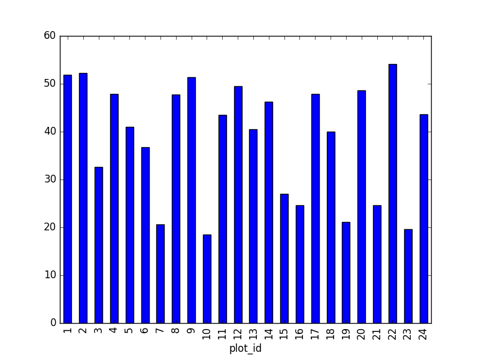

# Challenge solutions

## 00-short-introduction-to-Python

* What happens when you type `a_tuple[2] = 5` vs `a_list[1] = 5`?

	As a tuple is immutable, it does not support item assignment. Elements in a list can be altered individually.

* Type `type(a_tuple)` into python - what is the object type?

	`tuple`

* Can you do reassignment in a dictionary? Give it a try.

Make sure it is also clear that access to 'the second value' is actually just about the key name. Add for example `rev[10] = "ten"` to clarify it is not about the position.

## 01-starting-with-data

* `surveys_df.columns` 

	column names (optional: show `surveys_df.columns[4] = "plotid"` The index is not mutable; recap of previous lesson. Adapting the name is done by `rename` function `surveys_df.rename(columns={"plot_id": "plotid"})`)

* `surveys_df.head()`. Also, what does `surveys_df.head(15)` do?

	Show first `N` lines
	
* `surveys_df.tail()`
	
	Show last `N` lines
	
* `surveys_df.shape`. Take note of the output of the shape method. What format does it return the shape of the DataFrame in?

`type(surveys_df.shape)` -> `Tuple`

* Create a list of unique plot ID's found in the surveys data. Call it `plot_names`. How many unique plots are there in the data? How many unique species are in the data?

`plot_names = pd.unique(surveys_df["plot_id"])` Number of unique plot ID's: `plot_names.size` or `len(plot_names)`; Number of unique species in the data: `len(pd.unique(surveys_df["species"]))`

* How many recorded individuals are female `F` and how many male `M`?

`sorted.count()`

* What happens when you group by two columns using the following syntax and then grab mean values?

The mean value for each combination of plot and sex is calculated. Remark that the mean does not make sense for each variable, so you can specify this column wise: e.g. I want to know the last survey year, median foot-length and mean weight for each plot/sex combination: `surveys_df.groupby(['plot_id','sex']).agg({"year": 'min', "hindfoot_length": 'median', "weight": 'mean'})`

*  Summarize weight values for each plot in your data

`surveys_df.groupby(['plot_id'])['weight'].describe()`

* What's another way to create a list of species and associated count of the records in the data? 

Instead of getting the column of the groupby and counting it, you can also count on the groupby (all columns) and make a selection of the resulting data frame: `surveys_df.groupby('species_id').count()["record_id"]` 

* Create a plot of average weight across all species per plot.

`surveys_df.groupby('plot_id').mean()["weight"].plot(kind='bar')`

 

* Create a plot of total males versus total females for the entire datase

`surveys_df.groupby('sex').count()["record_id"].plot(kind='bar')`

