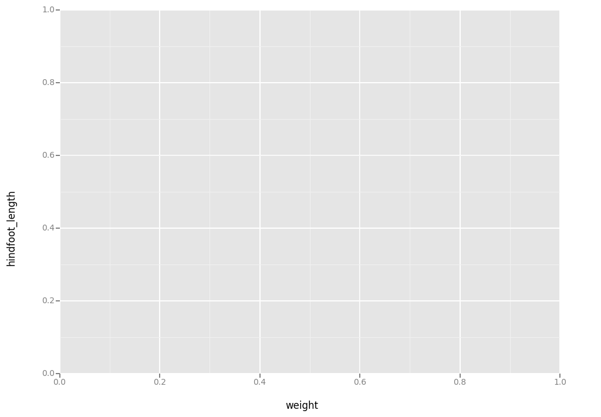
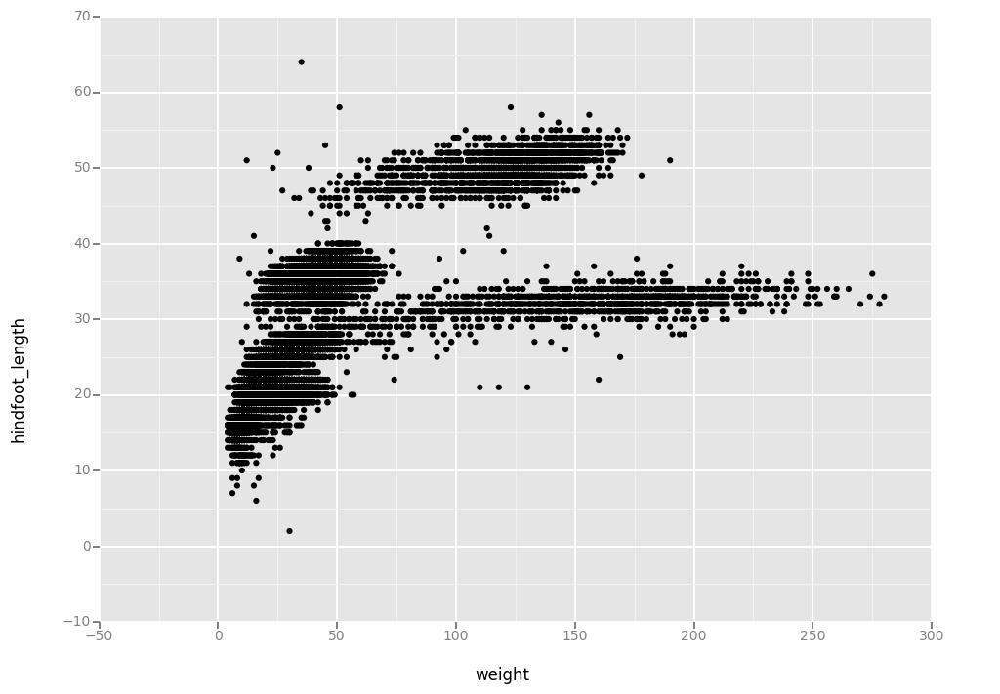
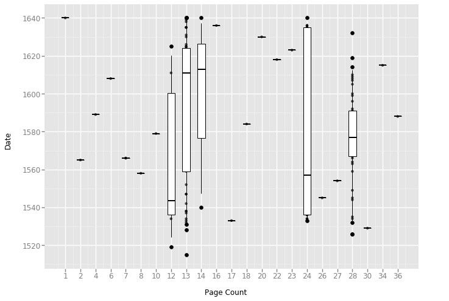
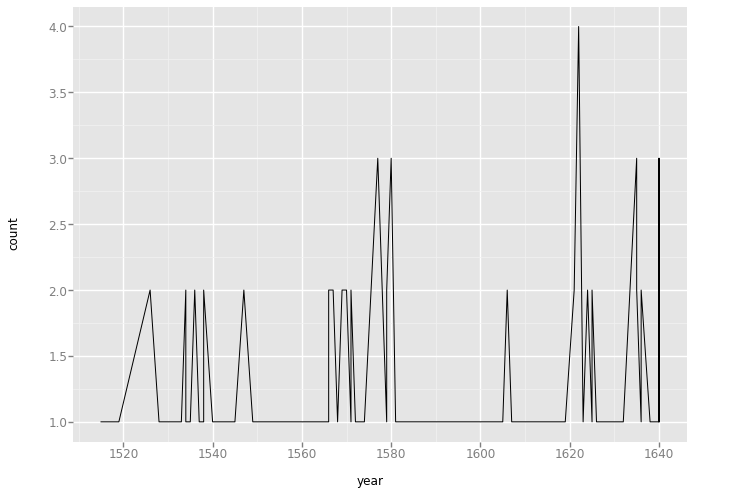

#### Disclaimer

Python has powerful built-in plotting capabilities such as `matplotlib`, but
for this exercise, we will be using the [`ggplot`](http://ggplot.yhathq.com/)
package, which facilitates the creation of highly-informative plots of
structured data based on the R implementation of
[`ggplot2`](http://ggplot2.org/) and [The Grammar of
Graphics](http://link.springer.com/book/10.1007%2F0-387-28695-0) by Leland
Wilkinson.

```python
import pandas as pd

authors_complete = pd.read_csv( '../data/eebo.csv', index_col=0)
authors_complete.index.name = 'X'
authors_complete
```
            EEBO    VID  ... Page Count             Place
X                        ...                             
A00002  99850634  15849  ...        134            London
A00005  99842408   7058  ...        302            London
A00007  99844302   9101  ...        386            London
A00008  99848896  14017  ...         14  The Netherlands?
A00011  99837000   1304  ...         54         Amsterdam
A00012  99853871  19269  ...         99            London
A00014  33143147  28259  ...          1            London
A00015  99837006   1310  ...         16            London
A00018  99850740  15965  ...         26          Germany?

149 rows x 10 columns

```python
from ggplot import *
```

# Plotting with ggplot

We will make the same plot using the `ggplot` package.

`ggplot` is a plotting package that makes it simple to create complex plots
from data in a dataframe. It uses default settings, which help creating
publication quality plots with a minimal amount of settings and tweaking.

ggplot graphics are built step by step by adding new elements.

To build a ggplot we need to:

- bind the plot to a specific data frame using the `data` argument

- define aesthetics (`aes`), by selecting the variables to be plotted and the variables to define the presentation
     such as plotting size, shape color, etc.,

We also set some notebook settings with a "%" statement to get interactive and
exportable plots

```python
%matplotlib notebook
ggplot( aesthetics= aes(x = 'Date', y = 'Page Count'), data = authors_complete)
```



<ggplot: (-9223372036552543572)>

- add `geoms` -- graphical representation of the data in the plot (points,
     lines, bars). To add a geom to the plot use `+` operator:

```python
ggplot( aes(x = 'Date', y = 'Page Count'), data = authors_complete) + geom_point()
```



<ggplot: (295366541)>

The `+` in the `ggplot2` package is particularly useful because it allows you
to modify existing `ggplot` objects. This means you can easily set up plot
"templates" and conveniently explore different types of plots, so the above
plot can also be generated with code like this:

```python
# Create
eebo_plot = ggplot( aes(x = 'Date', y = 'Page Count'), data = authors_complete)

# Draw the plot
eebo_plot + geom_point()
```


<ggplot: (295593725)>

Notes:

- Anything you put in the `ggplot()` function can be seen by any geom layers
  that you add (i.e., these are universal plot settings). This includes the x and
  y axis you set up in `aes()`.
- You can also specify aesthetics for a given geom independently of the
  aesthetics defined globally in the `ggplot()` function.

# Building your plots iteratively

Building plots with ggplot is typically an iterative process. We start by
defining the dataset we'll use, lay the axes, and choose a geom.

```python
ggplot(aes(x = 'Publication', y = 'Freq'), data = authors_complete, ) + geom_point()
```


<ggplot: (-9223372036581788156)>

Then, we start modifying this plot to extract more information from it. For
instance, we can add transparency (alpha) to avoid overplotting.
ggplot( aes(x = 'Date', y = 'Page Count'), data = authors_complete)
```python
ggplot( aes(x = 'Date', y = 'Page Count'), data = authors_complete) + \
    geom_point(alpha = 0.1)
```


<ggplot: (295894448)>

We can also add colors for all the points

```python
ggplot(aes(x = 'Publication', y = 'Freq'),data = authors_complete) + \
    geom_point(alpha = 0.1, color = "blue")
```


<ggplot: (291993969)>

Or to color each species in the plot differently:

```python
ggplot( aes(x = 'Date', y = 'Page Count', color='Place'), data = authors_complete) + \
    geom_point(alpha=0.5)
```


<ggplot: (295600781)>

# Boxplot

Visualising the distribution of weight within each species.


```python
ggplot( aes(x = 'Date', y = 'Page Count'), data = authors_complete) + geom_boxplot()
```


<ggplot: (-9223372036559103053)>

By adding points to boxplot, we can have a better idea of the number of
measurements and of their distribution:


```python
authors_complete['authors_factor'] = authors_complete['Place'].astype('category').cat.codes

xlabels = sorted(set(authors_complete['Page Count'].values) )
xcodes = sorted(set(authors_complete['authors_factor'].values))

ggplot(aes(x = 'authors_factor', y = 'Date'),data = authors_complete) + \
    geom_point(position='jitter',alpha=0.7,jittersize=0.4) + \
        scale_x_continuous(breaks=xcodes, labels=xlabels) + \
                         xlab('Page Count') + geom_boxplot(alpha=0)

```



Notice how the boxplot layer is behind the jitter layer? What do you need to
change in the code to put the boxplot in front of the points such that it's not
hidden.

> ## Challenge - Boxplot
>
> Boxplots are useful summaries, but hide the *shape* of the distribution. For
> example, if there is a bimodal distribution, this would not be observed with a
> boxplot. An alternative to the boxplot is the violin plot (sometimes known as a
> beanplot), where the shape (of the density of points) is drawn.
>
> - Replace the box plot with a violin plot; see `geom_violin()`
>
> In many types of data, it is important to consider the *scale* of the
> observations.  For example, it may be worth changing the scale of the axis to
> better distribute the observations in the space of the plot.  Changing the scale
> of the axes is done similarly to adding/modifying other components (i.e., by
> incrementally adding commands).
>
> - Represent weight on the log10 scale; see `scale_y_log10()`
>
> - Create boxplot for `Pages`.
>
> - Add color to the datapoints on your boxplot according to the plot from which
>   the sample was taken (`plot_id`)
>
> Hint: Check the class for `plot_id`. Consider changing the class of `plot_id`
> from integer to factor. Why does this change how R makes the graph?
>
>> ## Solution
>> ```python
>> Start with the boxplot we created:
>> ggplot(aes(x = 'authors_factor', y = 'Date'),data = authors_complete) + \
>>    geom_jitter(alpha=0.3) + \
>>        scale_x_discrete(breaks=xcodes, labels=xlabels) + \
>>                         xlab('Page Count') + geom_boxplot(alpha=0)
>> ```
>>
>> ```python
>> 1. Replace the box plot with a violin plot; see `geom_violin()`.
>>
>> ggplot(aes(x = 'authors_factor', y = 'Date'),data = authors_complete) + \
>>    geom_jitter(alpha=0.3) + \
>>        scale_x_discrete(breaks=xcodes, labels=xlabels) + \
>>                         xlab('Page Count') + geom_violin(alpha=0)
>> ```
>>
>> ```python
>> 2. Represent weight on the log10 scale; see `scale_y_log10()`.
>> ggplot(aes(x = 'authors_factor', y = 'Date'),data = authors_complete) + \
>>    geom_jitter(alpha=0.3) + \
>>        scale_x_discrete(breaks=xcodes, labels=xlabels) + \
>>                         xlab('Page Count') + geom_violin(alpha=0) + \
>>            scale_y_log(base=10)
>> ```
>>
>> ```python
>> 3. Create boxplot for `Page Count`.
>> ggplot(aes(x = 'authors_factor', y = 'Page Count'),data = authors_complete) + \
>>     geom_jitter(alpha=0.01) + \
>>        scale_x_discrete(breaks=xcodes, labels=xlabels) + \
>>                         xlab('Pages') + geom_boxplot(alpha=0) + \
>>            scale_y_log(base=10)
>>            
>> ```
>>
>> ```python
>> 4. Add color to the datapoints on your boxplot according to the
>>    plot from which the sample was taken (`plot_id`).
>>    Hint: Check the class for `plot_id`. Consider changing the class
>>    of `Place` from integer to factor. Why does this change how Python
>>    makes the graph?
>>
>> ggplot(aes(x = 'authors_factor', y = 'Page Count', color='Place'),data = authors_complete) + \
>>     geom_jitter(alpha=0.01) + \
>>        scale_x_discrete(breaks=xcodes, labels=xlabels) + \
>>                         xlab('Pages') + geom_boxplot(alpha=0) + \
>>            scale_y_log(base=10)
>>     
>> ```
> {: .solution}
{: .challenge}

# Plotting time series data

Let's calculate number of counts per year for each species. To do that we need
to group data first and count records within each group.

```python
#yearly_counts <- authors_complete %>%
                 group_by(year, species_id) %>%
                 tally
```

```python
yearly = authors_complete[['Date','Place','Page Count']].groupby(['Date', 'Place']).count().reset_index()
yearly_counts.columns = ['year','place', 'count']
yearly_counts
```

	year 	place 	count
0 	1515 	London 	1
1 	1519 	Londini 	1
2 	1526 	London 	2
3 	1528 	London 	1
4 	1529 	Malborow i.e. Antwerp 	1
5 	1531 	London 	1

[121 rows x 3 columns]

Timelapse data can be visualised as a line plot with years on x axis and counts
on y axis.

```python
ggplot(aes(x = 'year', y = 'count'),data = yearly_counts) + \
     geom_line()
```



<ggplot: (-9223372036580461736)>

Unfortunately this does not work, because we plot data for all the species
together. We need to tell ggplot to draw a line for each species by modifying
the aesthetic function to include `group = Place`.

```python
ggplot(aes(x = 'year', y = 'count', group='place', color='place'),data = yearly_counts) + geom_line()
```

# Faceting

ggplot has a special technique called *faceting* that allows to split one plot
into multiple plots based on a factor included in the dataset. We will use it to
make one plot for a time series for each species.

```python
ggplot(aes(x = "year", y = "count", colour = "place"),data = yearly_counts) + \
    geom_line() + \
    facet_wrap("place")

```

Now we would like to split line in each plot by status of each place of
publication. To do that we need to make counts in data frame grouped by year,
place, and status:

```python
yearly_status = authors_complete.groupby( ['Date','Place', 'Status']).count()
yearly_status["n"] = yearly_status["EEBO"]
yearly_status = yearly_status["n"].reset_index()
yearly_status
```

We can now make the faceted plot splitting further by sex (within a single plot):

```python
ggplot(aes(x = "Date", y = "n", group = "Status", color="Place"), data = yearly_status ) + \
    geom_line() + \
    facet_wrap( "Place")
```

Usually plots with white background look more readable when printed.  We can set
the background to white using the function `theme_bw()`. Additionally you can also remove
the grid.

```python
 ggplot(aes(x = "Date", y = "n", group = "Status"), data = yearly_status) + \
     geom_line() + \
            facet_wrap( "species_id") + \
                theme_bw() + \
                theme()
```

To make the plot easier to read, we can color by status instead of Places (Places
are already in separate plots, so we don't need to distinguish them further).

```python
ggplot(aes(x = "Date", y = "n", group = "Status", color="Status"), data = yearly_status) + \
    geom_line() + \
    facet_wrap("Place") + \
    theme_bw()
```

> ## Challenge - Plotting
>
> Use what you just learned to create a plot that depicts how the average weight
> of each species changes through the years.
>
>> ## Solution
>>
>> ```python
>> yearly_length = authors_complete[["Date", "Place","Page Count"]].groupby(["Date", "Place"]).mean().reset_index()
>> yearly_length.columns =   ["year", "Place","Pages"]
>> yearly_length
>> ```
>>
>> ```python
>> ggplot( aes(x="year", y="Pages", color = "Place", group = "Place"),data = yearly_length) + \
>>    geom_line() + \
>>    facet_wrap("Place") + \
>>    theme_bw()
>> ```
> {: .solution}
{: .challenge}

The `facet_wrap` geometry extracts plots into an arbitrary number of dimensions
to allow them to cleanly fit on one page. On the other hand, the `facet_grid`
geometry allows you to explicitly specify how you want your plots to be
arranged via formula notation (`rows ~ columns`; a `.` can be used as
a placeholder that indicates only one row or column).

Let's modify the previous plot to compare how the page length has changed 
through time.

```python
## One column, facet by rows
yearly_status = authors_complete[["Date", "Status", "Page Count"]].groupby(["Date", "Status"]).mean().reset_index()
yearly_status.columns = ["year", "Status", "Length"]
yearly_status
```

```python
# One row, facet by column
ggplot( aes(x="year", y="Length", color = "Place", group = "Place"),data = yearly_status) + \
    geom_line() + \
    facet_grid("Place")
```
```python
# One row, facet by column
ggplot( aes(x="year", y="Length", color = "Place", group = "Place"),data = yearly_status) + \
    geom_line() + \
    facet_grid(None, "Place")
```

# Customization

Take a look at the ggplot2 cheat sheet
(https://www.rstudio.com/wp-content/uploads/2015/08/ggplot2-cheatsheet.pdf), and
think of ways to improve the plot. You can write down some of your ideas as
comments in the Etherpad.

Now, let's change names of axes to something more informative than 'year'
and 'n' and add a title to this figure:

```python
ggplot(aes(x="year", y="Length", group = "Place"), data = yearly_status) + \
    geom_line() + \
    facet_wrap( "Place" ) + \
    labs(title = 'Number of pages in EEBO/TCP texts by publication',
         x = 'Number of texts',
         y = 'Publication Date') + \
    theme_bw()
```

The axes have more informative names, but their readability can be improved by
increasing the font size. While we are at it, we'll also change the font family:

```python
ggplot(aes(x="year", y="Length", group = "Place"), data = yearly_status) + \
    geom_line() + \
    facet_wrap( "Place" ) + \
    theme_bw() + \
    theme(axis_title_x = element_text(size=16, family="Arial"),
         axis_title_y = element_text(size=16, family="Arial")) + \
    labs(title = 'Number of pages by year by status',
        x = 'Number of Pages',
        y = 'Year of Publication')
```


After our manipulations we notice that the values on the x-axis are still not
properly readable. Let's change the orientation of the labels and adjust them
vertically and horizontally so they don't overlap. You can use a 90 degree
angle, or experiment to find the appropriate angle for diagonally oriented
labels.


```python
ggplot(aes(x="year", y="Length", group = "Place"), data = yearly_status) + \
    geom_line() + \
    facet_wrap( "Status" ) + \
    labs(title = 'Number of Pages by Place of Publication',
        x = 'Number of Pages',
        y = 'Year of Publication') + \
    theme_bw() + \
    theme(axis_text_x = element_text(color="grey", size=10, angle=90, hjust=.5, vjust=.5),
          axis_text_y = element_text(color="grey", size=10, hjust=0),
         )
```


If you like the changes you created to the default theme, you can save them as
an object to easily apply them to other plots you may create:

```python
arial_grey_theme = theme(axis_text_x = element_text(color="grey", size=10, angle=90, hjust=.5, vjust=.5),
                          axis_text_y = element_text(color="grey", size=10))
ggplot(yearly_status, aes(x="year", y="Length")) + \
    geom_boxplot() + \
    arial_grey_theme
```

With all of this information in hand, please take another five minutes to either
improve one of the plots generated in this exercise or create a beautiful graph
of your own. Use the RStudio ggplot2 cheat sheet, which we linked earlier for
inspiration.

Here are some ideas:

* See if you can change thickness of the lines.
* Can you find a way to change the name of the legend? What about its labels?
* Use a different color palette (see http://www.cookbook-r.com/Graphs/Colors_(ggplot2)/)

After creating your plot, you can save it to a file in your favourite format.
You can easily change the dimension (and its resolution) of your plot by
adjusting the appropriate arguments (`width`, `height` and `dpi`):


```python
my_plot =  ggplot(yearly_status, aes(x = "year", y = "Length", group = "Place"))
my_plot += geom_line()
my_plot += facet_wrap("Place")
my_plot += labs(title = 'Number of pages per year',
                x = 'Number of Pages',
                y = 'Year of Publication')
my_plot += theme_bw()
my_plot += theme(axis_text_x = element_text(color="grey", size=10, angle=90, hjust=.5, vjust=.5),
                        axis_text_y = element_text(color="grey", size=10))
my_plot.save("name_of_file.png", width=15, height=10)
```

> ## Final plotting challenge
>  With all of this information in hand, please take another five
>  minutes to either improve one of the plots generated in this
>  exercise or create a beautiful graph of your own. Use the RStudio
>  ggplot2 cheat sheet for inspiration:
>  https://www.rstudio.com/wp-content/uploads/2015/08/ggplot2-cheatsheet.pdf
{: .challenge}
