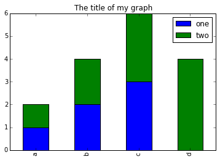

# Working With Pandas DataFrames in Python

We can automate the process above using Python. It's efficient to spend time
building the code to perform these tasks because once it's built, we can use it
over and over on different datasets that use a similar format. This makes our
methods easily reproducible. We can also easily share our code with colleagues
and they can replicate the same analysis.

### Starting in the same spot

To help the lesson run smoothly, let's ensure everyone is in the same directory.
This should help us avoid path and file name issues. At this time please
navigate to the workshop directory. If you working in IPython Notebook be sure
that you start your notebook in the workshop directory.

A quick aside that there are Python libraries like [OS
Library](https://docs.python.org/3/library/os.html) that can work with our
directory structure, however, that is not our focus today.

### Alex's Processing

Alex is a researcher who is interested in Early English books. Alex knows the EEBO dataset and refers to it to find data such as titles, places, and authors. As well as searching for titles, they want to create some exploratory plots and intermediate datasets. 

Alex can do some of this work using spreadsheet systems but this can be time consuming to do  and check. It can lead to mistakes that are hard to detect. 

The next steps show how Python can be used to automate some of the processes. 

As a result of creating Python scripts, the data can be re-run in the future. 

### Our Data

For this lesson, we will be using the EEBO catalogue data, a subset of the data
from EEBO/TCP
[Early English Books Online/Text Creation Partnership](https://eebo.chadwyck.com/home)

We will be using files from the data folder.
This section will use the `eebo.csv` file that can be found in the data folder.

We are studying the authors and titles published marked up by the Text Creation Partnership. The dataset is stored as a `.csv` file: each row holds information for a single title, and the columns represent:

| Column           | Description                        |
|------------------|------------------------------------|
| TCP              | TCP identity                       |
| EEBO             | EEBO identity                      |
| VID              | VID identity                       |
| STC              | STC identity                       |
| status           | Whether the book is free or not    |
| Author           | Author(s)                          |
| Date             | Date of publication                |
| Title            | The Book title                     |
| Terms            | Terms associated with the text     |
| Page Count       | Number of pages in the text        |
| Place            | Location where published           |

The first few rows of our first file look like this:

```
TCP,EEBO,VID,STC,Status,Author,Date,Title,Terms,Page Count,Place
A00002,99850634,15849,STC 1000.5; ESTC S115415,Free,"Aylett, Robert, 1583-1655?",1625,"The brides ornaments viz. fiue meditations, morall and diuine. 1. Knowledge, 2. zeale, 3. temperance, 4. bountie, 5. ioy.",,134,London
A00005,99842408,7058,STC 10000; ESTC S106695,Free,"Higden, Ranulf, d. 1364. Polycronicon. English. Selections.; Trevisa, John, d. 1402.",1515,Here begynneth a shorte and abreue table on the Cronycles ...; Saint Albans chronicle.,Great Britain -- History -- To 1485 -- Early works to 1800.; England -- Description and travel -- Early works to 1800.,302,London
A00007,99844302,9101,STC 10002; ESTC S108645,Free,"Higden, Ranulf, d. 1364. Polycronicon.",1528,"The Cronycles of Englonde with the dedes of popes and emperours, and also the descripcyon of Englonde; Saint Albans chronicle.",Great Britain -- History -- To 1485 -- Early works to 1800.; England -- Description and travel -- Early works to 1800.,386,London
A00008,99848896,14017,STC 10003; ESTC S113665,Free,"Wood, William, fl. 1623, attributed name.",1623,Considerations vpon the treaty of marriage between England and Spain,Great Britain -- Foreign relations -- Spain.,14,The Netherlands?
A00011,99837000,1304,STC 10008; ESTC S101178,Free,,1640,"Englands complaint to Iesus Christ, against the bishops canons of the late sinfull synod, a seditious conuenticle, a packe of hypocrites, a sworne confederacy, a traiterous conspiracy ... In this complaint are specified those impieties and insolencies, which are most notorious, scattered through the canons and constitutions of the said sinfull synod. And confuted by arguments annexed hereunto.",Church of England. -- Thirty-nine Articles -- Controversial literature.; Canon law -- Early works to 1800.,54,Amsterdam
A00012,99853871,19269,STC 1001; ESTC S118664,Free,"Aylett, Robert, 1583-1655?",1623,"Ioseph, or, Pharoah's fauourite; Joseph.",Joseph -- (Son of Jacob) -- Early works to 1800.,99,London
A00014,33143147,28259,STC 10011.6; ESTC S3200,Free,,1624,Greate Brittaines noble and worthy councell of warr,"England and Wales. -- Privy Council -- Portraits.; Great Britain -- History -- James I, 1603-1625.; Broadsides -- London (England) -- 17th century.",1,London
A00015,99837006,1310,STC 10011; ESTC S101184,Free,"Jones, William, of Usk.",1607,"Gods vvarning to his people of England By the great ouer-flowing of the vvaters or floudes lately hapned in South-wales and many other places. Wherein is described the great losses, and wonderfull damages, that hapned thereby: by the drowning of many townes and villages, to the vtter vndooing of many thousandes of people.",Floods -- Wales -- Early works to 1800.,16, London
A00018,99850740,15965,STC 10015; ESTC S115521,Free,,1558,The lame[n]tacion of England; Lamentacion of England.,"Great Britain -- History -- Mary I, 1553-1558 -- Early works to 1800.",26,Germany?
```

---

## About Libraries
A library in Python contains a set of tools (called functions) that perform
tasks on our data. Importing a library is like getting a piece of lab equipment
out of a storage locker and setting it up on the bench for use in a project.
Once a library is set up, it can be used or called to perform many tasks.

## Pandas in Python
One of the best options for working with tabular data in Python is to use the
[Python Data Analysis Library](http://pandas.pydata.org/) (a.k.a. Pandas). The
Pandas library provides data structures, produces high quality plots with
[matplotlib](http://matplotlib.org/) and integrates nicely with other libraries
that use [NumPy](http://www.numpy.org/) (which is another Python library) arrays.

Python doesn't load all of the libraries available to it by default. We have to
add an `import` statement to our code in order to use library functions. To import
a library, we use the syntax `import libraryName`. If we want to give the
library a nickname to shorten the command, we can add `as nickNameHere`.  An
example of importing the pandas library using the common nickname `pd` is below.


```python
import pandas as pd
```

Each time we call a function that's in a library, we use the syntax
`LibraryName.FunctionName`. Adding the library name with a `.` before the
function name tells Python where to find the function. In the example above, we
have imported Pandas as `pd`. This means we don't have to type out `pandas` each
time we call a Pandas function.


# Reading CSV Data Using Pandas

We will begin by locating and reading our survey data which are in CSV format.
We can use Pandas' `read_csv` function to pull the file directly into a
[DataFrame](http://pandas.pydata.org/pandas-docs/stable/dsintro.html#dataframe).

In order to read data in, we need to know where the data is stored on your computer.
It is recommended to place the data files in the same directory as the Jupyter notebook

```python
# note that pd.read_csv is used because we imported pandas as pd
# note that this assumes that the data file is in the same location
# as the Jupyter notebook
pd.read_csv("eebo.csv")
```


## So What's a DataFrame?

A DataFrame is a 2-dimensional data structure that can store data of different
types (including characters, integers, floating point values, factors and more)
in columns. It is similar to a spreadsheet or an SQL table or the `data.frame` in
R. A DataFrame always has an index (0-based). An index refers to the position of
an element in the data structure.


The above command yields the **output** below:

```
          TCP        EEBO     VID  \
0      A00002  99850634.0   15849   
1      A00005  99842408.0    7058   
2      A00007  99844302.0    9101   
3      A00008  99848896.0   14017   
4      A00011  99837000.0    1304
...
146  A00525  99856552        ...                854   Prentyd  London
147  A00527  99849909        ...                 72            London
148  A00535  99849912        ...                106        Saint-Omer 
[148 rows x 11 columns]
```

We can see that there were 149 rows parsed. Each row has 11
columns. The first column is the index of the DataFrame. The index is used to
identify the position of the data, but it is not an actual column of the DataFrame.
It looks like  the `read_csv` function in Pandas  read our file properly. However,
we haven't saved any data to memory so we can work with it.We need to assign the
DataFrame to a variable. Remember that a variable is a name for a value, such as `x`,
or  `data`. We can create a new  object with a variable name by assigning a value to it using `=`.

Let's call the imported survey data `eebo_df`:

```python
eebo_df = pd.read_csv("eebo.csv")
```

Notice when you assign the imported DataFrame to a variable, Python does not
produce any output on the screen. We can print the value of the `eebo_df`
object by typing its name into the Python command prompt.

```python
eebo_df
```

which prints contents like above

## Manipulating Our Index Data

Now we can start manipulating our data. First, let's check the data type of the
data stored in `eebo_df` using the `type` method. **The `type` method and
`__class__` attribute** tell us that `eebo_df` is `<class 'pandas.core.frame.DataFrame'>`.

```python
type(eebo_df)
# this does the same thing as the above!
eebo_df.__class__
```
We can also enter `eebo_df.dtypes` at our prompt to view the data type for each
column in our DataFrame. `int64` represents numeric integer values - `int64` cells
can not store decimals. `object` represents strings (letters and numbers). `float64`
represents numbers with decimals.

	eebo_df.dtypes

which returns:

```
TCP         object
EEBO        float64
VID         object
STC         object
Status      object
Author      object
Date        object
Title       object
Terms       object
Page Count  int64
dtype: object
```

We'll talk a bit more about what the different formats mean in a different lesson.

### Useful Ways to View DataFrame objects in Python

There are many ways to summarize and access the data stored in DataFrames,
using attributes and methods provided by the DataFrame object.

To access an attribute, use the DataFrame object name followed by the attribute
name `df_object.attribute`. Using the DataFrame `eebo_df` and attribute
`columns`, an index of all the column names in the DataFrame can be accessed
with `eebo_df.columns`.

Methods are called in a similar fashion using the syntax `df_object.method()`.
As an example, `eebo_df.head()` gets the first few rows in the DataFrame
`eebo_df` using **the `head()` method**. With a method, we can supply extra
information in the parens to control behaviour.

Let's look at the data using these.

> ## Challenge - DataFrames
>
> Using our DataFrame `eebo_df`, try out the attributes & methods below to see
> what they return.
>
> 1. `eebo_df.columns`
> 2. `eebo_df.shape` Take note of the output of `shape` - what format does it
>    return the shape of the DataFrame in?
>    
>    HINT: [More on tuples, here](https://docs.python.org/3/tutorial/datastructures.html#tuples-and-sequences).
> 3. `eebo_df.head()` Also, what does `eebo_df.head(15)` do?
> 4. `eebo_df.tail()`
{: .challenge}


## Calculating Statistics From Data In A Pandas DataFrame

We've read our data into Python. Next, let's perform some quick summary
statistics to learn more about the data that we're working with. We might want
to know how many animals were collected in each plot, or how many of each
species were caught. We can perform summary stats quickly using groups. But
first we need to figure out what we want to group by.

Let's begin by exploring our data:

```python
# Look at the column names
eebo_df.columns.values
```

which **returns**:

```
array(['TCP', 'EEBO', 'VID', 'STC', 'Status', 'Author', 'Date', 'Title',
       'Terms', 'Page Count', 'Place'], dtype=object)
```

Let's get a list of all the page counts. The `pd.unique` function tells us all of
the unique values in the `Pages` column.

```python
pd.unique(eebo_df['Page Count'])
```

which **returns**:

```python
array([134, 302, 386,  14,  54,  99,   1,  16,  26,  62,  50,  66,  30,
         6,  36,   8,  12,  24,  22,   7,  20,  40,  38,  13,  28,  10,
        23,   2, 112,  18,   4,  27,  42,  17,  46,  58, 200, 158,  65,
        96, 178,  52, 774,  81, 392,  74, 162,  56, 100, 172,  94,  79,
       107,  48, 102, 343, 136,  70, 156, 133, 228, 357, 110,  72,  44,
        43,  37,  98, 566, 500, 746, 884, 254, 618, 274, 188, 374,  47,
        34, 177,  82,  78,  64, 124,  80, 108, 182, 120,  68, 854, 106])
```

> ## Challenge - Statistics
>
> 1. Create a list of unique locations found in the index data. Call it
>   `places`. How many unique location are there in the data?
>
> 2. What is the difference between `len(places)` and `eebo_df['Place'].nunique()`?
{: .challenge}

# Groups in Pandas

We often want to calculate summary statistics grouped by subsets or attributes
within fields of our data. For example, we might want to calculate the average
weight of all individuals per plot.

We can calculate basic statistics for all records in a single column using the
syntax below:

```python
eebo_df['Page Count'].describe()
```
gives **output**

```python
count    149.000000
mean     104.382550
std      160.125398
min        1.000000
25%       16.000000
50%       52.000000
75%      108.000000
max      884.000000
Name: Page Count, dtype: float64
```

We can also extract one specific metric if we wish:

```python
eebo_df['Page Count'].min()
eebo_df['Page Count'].max()
eebo_df['Page Count'].mean()
eebo_df['Page Count'].std()
eebo_df['Page Count'].count()
```

But if we want to summarize by one or more variables, for example sex, we can
use **Pandas' `.groupby` method**. Once we've created a groupby DataFrame, we
can quickly calculate summary statistics by a group of our choice.

```python
# Group data by status
grouped_data = eebo_df.groupby('Place')
```

The **pandas function `describe`** will return descriptive stats including: mean,
median, max, min, std and count for a particular column in the data. Pandas'
`describe` function will only return summary values for columns containing
numeric data.

```python
# summary statistics for all numeric columns by place
grouped_data.describe()
# provide the mean for each numeric column by place
grouped_data.mean()
```

`grouped_data.mean()` **OUTPUT:**

```python
                                       EEBO     ...      Page Count
Place                                           ...                
Amsterdam                      9.983700e+07     ...       54.000000
Antverpi                       9.983759e+07     ...       34.000000
Antwerp                        9.985185e+07     ...       40.000000
Cambridge                      2.445926e+07     ...        1.000000
Emden                          9.984713e+07     ...       58.000000

```

The `groupby` command is powerful in that it allows us to quickly generate
summary stats.

> ## Challenge - Summary Data
>
> 1. What is the mean page length for books published in `Amsterdam` and how many for `London`
> 2. What happens when you group by two columns using the following syntax and
>    then grab mean values:
>	- `grouped_data2 = eebo_df.groupby(['EEBO','Page Count'])`
>	- `grouped_data2.mean()`
> 3. Summarize the Date values in your data. HINT: you can use the
>   following syntax to only create summary statistics for one column in your data
>   `eebo_df['Page Count'].describe()`
>
>
>> ## Did you get #3 right?
>> **A Snippet of the Output from challenge 3 looks like:**
>>
>> ```
>>	
>>	      count    149.000000
>>	      mean    1584.288591
>>	      std       36.158864
>>	      min     1515.000000
>>	      25%     1552.000000
>>	      50%     1583.000000
>>	      75%     1618.000000
>>	      max     1640.000000
>>          ...
>> ```
> {: .solution}
{: .challenge}

## Quickly Creating Summary Counts in Pandas

Let's next count the number of samples for each author. We can do this in a few
ways, but we'll use `groupby` combined with **a `count()` method**.


```python
# count the number of texts by authors
author_counts = eebo_df.groupby('Author')['EEBO'].count()
print(author_counts)
```

Or, we can also count just the rows that have the author "A. B.":

```python
eebo_df.groupby('Author')['EEBO'].count()['Aylett, Robert, 1583-1655?']
```

> ## Challenge - Make a list
>
>  What's another way to create a list of authors and associated `count` of the
>  records in the data? Hint: you can perform `count`, `min`, etc functions on
>  groupby DataFrames in the same way you can perform them on regular DataFrames.
{: .challenge}

## Basic Math Functions

If we wanted to, we could perform math on an entire column of our data. For
example let's multiply all weight values by 2. A more practical use of this might
be to normalize the data according to a mean, area, or some other value
calculated from our data.

	# multiply all page length values by 2
	eebo_df['Page Count']*2

# Quick & Easy Plotting Data Using Pandas

We can plot our summary stats using Pandas, too.

```python
# when using a Jupyter notebook, force graphs to appear in line
%matplotlib inline
# Collect data together
date_count = eebo_df.groupby("Date")["Status"].count()
date_count.plot(kind="bar")
```


What does this graph show? Let's step through
* `eebo_df.groupby("Date")` : This groups the texts by the date in which they
were published
* `eebo_df.groupby("Date")["Status"]` : This chooses a single column to count,
rather than counting all columns
* `eebo_df.groupby("Date")["Status"].count()` : this counts the instances, i.e. 
how many texts in a given year have a status?
* `date_count.plot(kind="bar")` : this plots that data as a bar chart

```

> ## Challenge - Plots
>
> 1. Create a plot of Authors across all Places per plot. Does it look how you
expect it to look?
{: .challenge}

> ## Summary Plotting Challenge
>
> Create a stacked bar plot, showing the total pages published, per year, with
> the different publishing locations stacked on top of each other. The Date
> should go on the X axis, and the Page Count on the Y axis. Some tips are below
> to help you solve this challenge:
>
> * [For more on Pandas plots, visit this link.](http://pandas.pydata.org/pandas-docs/stable/visualization.html#basic-plotting-plot)
> * You can use the code that follows to create a stacked bar plot but the data to stack
>  need to be in individual columns.  Here's a simple example with some data where
>  'a', 'b', and 'c' are the groups, and 'one' and 'two' are the subgroups.
>
> ```
> d = {'one' : pd.Series([1., 2., 3.], index=['a', 'b', 'c']),'two' : pd.Series([1., 2., 3., 4.], index=['a', 'b', 'c', 'd'])}
> pd.DataFrame(d)
> ```
>
> shows the following data
>
> ```
>       one  two
>   a    1    1
>   b    2    2
>   c    3    3
>   d  NaN    4
> ```
>
> We can plot the above with
>
> ```
> # plot stacked data so columns 'one' and 'two' are stacked
> my_df = pd.DataFrame(d)
> my_df.plot(kind='bar', stacked=True, title="The title of my graph")
> ```
>
> 
>
> * You can use the `.unstack()` method to transform grouped data into columns
> for each plotting.  Try running `.unstack()` on some DataFrames above and see
> what it yields.
>
> Start by transforming the grouped data into an unstacked layout, then create
> a stacked plot.
>
>
>> ## Solution to Summary Challenge
>>
>> First we group data by date and then by place. 
>>
>> ```python
>> date_place = eebo_df.groupby(['Date','Place'])
>> page_sum = date_place['Page Count'].sum()
>> ```
>>
>> This calculates the sums for each place, for each date, as a table
>>
>> ```
>> page_sum
>> Date    Place
>> 1515    London    302
>> 1519    Londini   74
>> 1526     London   150
>> 1528    London    386
>> <other plots removed for brevity>
>> ```
>> 
>> After that, we use the `.unstack()` function on our grouped data to figure
>> out the total contribution of each place, to each year, and then plot the
>> data
>> ```python
>> table = page_sum.unstack()
>> plot = table.plot(kind="bar", stacked=True, title="Pages published per year", figsize=(10,5))
>> plot.set_ylabel("Pages")
>> ```
> {: .solution}
{: .challenge}
