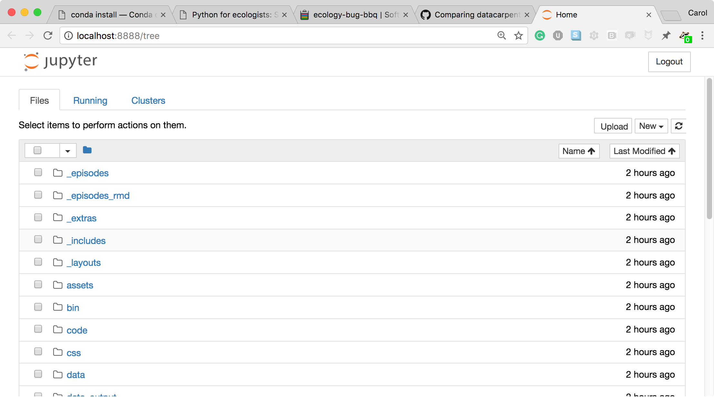
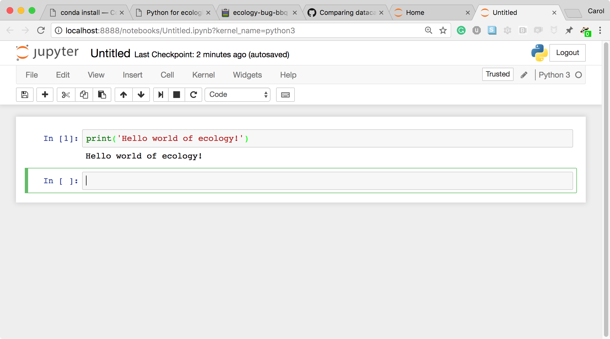
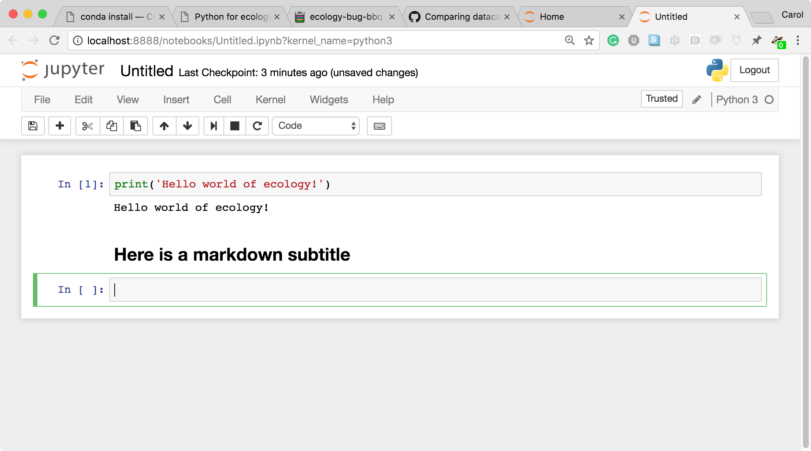
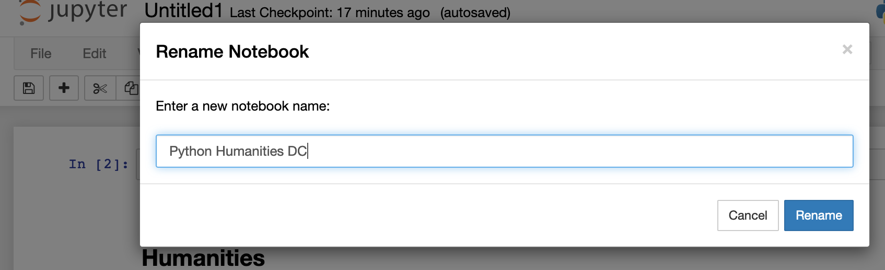

::::::::::::::::::::::::::::::::::::::::::  prereq

## Data

Data for this lesson is from the Humanities Lesson data.

In this course, several data files will be used as examples. You can download
these example data files by right-clicking on the following links and selecting
"Save as" (or clicking on the link, then right-clicking on the file and selecting
"Save as" if you are on a windows machine). You should save them in a memorable location,
as you will need to tell Python where they are later.

- For lessons 2-4, and 6-8: [eebo.csv](https://raw.githubusercontent.com/carpentries-incubator/python-humanities-lesson/gh-pages/data/eebo.csv)
- For lesson 5,
  - [authors.csv](https://raw.githubusercontent.com/carpentries-incubator/python-humanities-lesson/gh-pages/data/authors.csv)
  - [places.csv](https://raw.githubusercontent.com/carpentries-incubator/python-humanities-lesson/gh-pages/data/places.csv)
  - [1635\.csv](https://raw.githubusercontent.com/carpentries-incubator/python-humanities-lesson/gh-pages/data/1635.csv)
  - [1640\.csv](https://raw.githubusercontent.com/carpentries-incubator/python-humanities-lesson/gh-pages/data/1640.csv)
  - For lesson 9: [eebo database](data/eebo.db)
    

::::::::::::::::::::::::::::::::::::::::::::::::::

Python is a popular language for scientific computing, and great for general-purpose programming as well. Installing all of the scientific packages we use in the lesson individually can be a bit cumbersome, and therefore recommend the all-in-one installer Anaconda.

Regardless of how you choose to install it, please make sure you install Python version 3.x (e.g., 3.6 is fine).

::::::::::::::::::::::::::::::::::::::::::  prereq

## Software

[Python](https://python.org) is a popular language for scientific computing, and great for
general-purpose programming as well. Installing all of the scientific packages we use in this lesson
individually can be a bit cumbersome, and therefore we recommend the all-in-one
installer [Anaconda][[anaconda](https://www.anaconda.com/)].

Regardless of how you choose to install it, please make sure you install Python
version 3.x (e.g., 3.6 is fine).

## Required Python Packages for this workshop

- [Pandas](https://pandas.pydata.org/)
- [Jupyter notebook](https://jupyter.org/)
- [Numpy](https://www.numpy.org/)
- [Matplotlib](https://matplotlib.org/)
- [Bokeh](https://bokeh.org/)
  

::::::::::::::::::::::::::::::::::::::::::::::::::

## Install the workshop packages

For installing these packages we will use Anaconda or Miniconda.
They both use [Conda](https://conda.pydata.org/docs/), the main difference is
that Anaconda comes with a lot of packages pre-installed.
With Miniconda you will need to install the required packages.

### Anaconda installation

Anaconda will install the workshop packages for you. You only need one of the two.

#### Download and install Anaconda

Download and install [Anaconda](https://www.anaconda.com/distribution/).
Remember to download and install the installer for Python 3.x.

### Miniconda installation

Miniconda is a "light" version of Anaconda. If you install and use Miniconda
you will also need to install the workshop packages.

#### Download and install Miniconda

Download and install [Miniconda](https://conda.pydata.org/miniconda.html)
following the instructions. Remember to download and run the installer for
Python 3.x.

#### Check the installation of Miniconda

From the terminal, type:

```
conda list
```

### Install the required workshop packages with conda

From the terminal, type:

```
conda install -y numpy pandas matplotlib jupyter
conda install -y -c conda-forge bokeh
```

## Launch a Jupyter notebook

After installing either Anaconda or Miniconda and the workshop packages,
launch a Jupyter notebook by typing this command from the terminal:

```
jupyter notebook
```

The notebook should open automatically in your browser. If it does not or you
wish to use a different browser, open this link: [http://localhost:8888](https://localhost:8888).

***

## Overview of the Jupyter notebook (Optional)

{alt='Example Jupyter Notebook'}  
*Screenshot of a [Jupyter Notebook on quantum mechanics](https://github.com/jrjohansson/qutip-lectures) by Robert Johansson*

### How the Jupyter notebook works

After typing the command `jupyter notebook`, the following happens:

- A Jupyter Notebook server is automatically created on your local machine.

- The Jupyter Notebook server runs locally on your machine only and does not
  use an internet connection.

- The Jupyter Notebook server opens the Jupyter notebook client, also known
  as the notebook user interface, in your default web browser.
  
  {alt='Jupyter notebook file browser'}  
  *The Jupyter notebook file browser*

- To create a new Python notebook select the "New" dropdown on the upper
  right of the screen.
  
  {alt='Jupyter notebook file browser'}  
  *The Jupyter notebook file browser*

- When you can create a new notebook and type code into the browser, the web
  browser and the Jupyter notebook server communicate with each other.
  
  {alt='new Jupyter notebook'}  
  *A new, blank Jupyter notebook*

- Under the "help" menu, take a quick interactive tour of how to
  use the notebook. Help on Jupyter and key workshop packages is
  available here too.
  
  {alt='Jupyter tour and help'}  
  *User interface tour and Help*

- The Jupyter Notebook server does the work and calculations, and the web
  browser renders the notebook.

- The web browser then displays the updated notebook to you.

- For example, click in the first cell and type some Python code.
  
  {alt='Code cell'}  
  *A Code cell*

- This is a **Code** cell (see the cell type dropdown with the word **Code**).
  To run the cell, type Shift-Enter.
  
  {alt='Code cell and its output'}  
  *A Code cell and its output*

- Let's look at a **Markdown** cell. Markdown is a text manipulation
  language that is readable yet offers additional formatting. Don't forget
  to select **Markdown** from the cell type dropdown. Click in the cell and
  enter the markdown text.
  
  {alt='markdown input cell'}  
  *A markdown input cell*

- To run the cell, type Shift-Enter.
  
  {alt='rendered markdown cell'}  
  *A rendered markdown cell*

This workflow has several advantages:

- You can easily type, edit, and copy and paste blocks of code.
- Tab completion allows you to easily access the names of things you are using
  and learn more about them.
- It allows you to annotate your code with links, different sized text,
  bullets, etc. to make information more accessible to you and your
  collaborators.
- It allows you to display figures next to the code that produces them
  to tell a complete story of the analysis.

### Changing the Title

- You can change the Notebooks's title by clicking on the title cell
  
  {alt='Original notebook title'}

- Rename the folder in the box and click "Rename"
  
  {alt='Renamed notebook title'}

### How the notebook is stored

- The notebook file is stored in a format called JSON and has the suffix
  `.ipynb`.
- Just like HTML for a webpage, what's saved in a notebook file looks
  different from what you see in your browser.
- But this format allows Jupyter to mix software (in several languages) with
  documentation and graphics, all in one file.

### Notebook modes: Control and Edit

The notebook has two modes of operation: Control and Edit. Control mode lets
you edit notebook level features; while, Edit mode lets you change the
contents of a notebook cell. Remember a notebook is made up of a number of
cells which can contain code, markdown, html, visualizations, and more.

### Help and more information

Use the **Help** menu and its options when needed.


